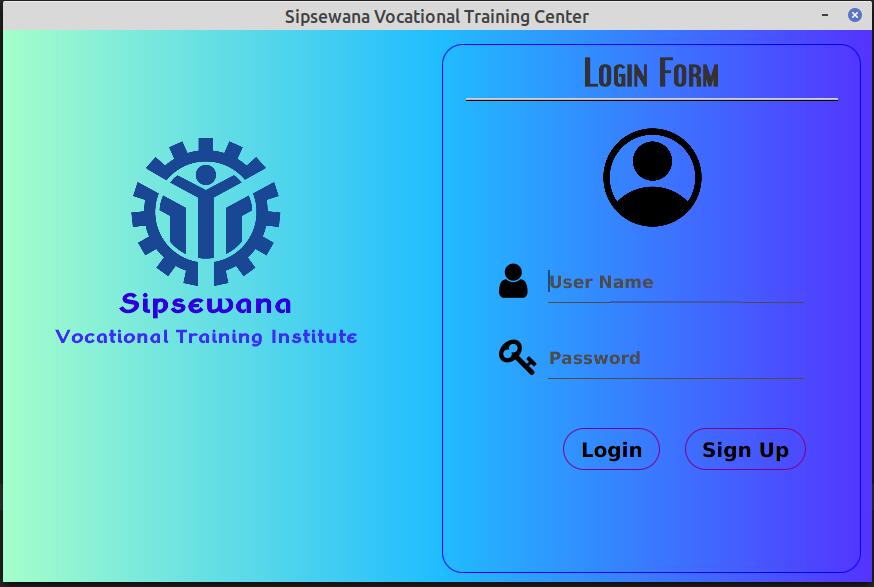
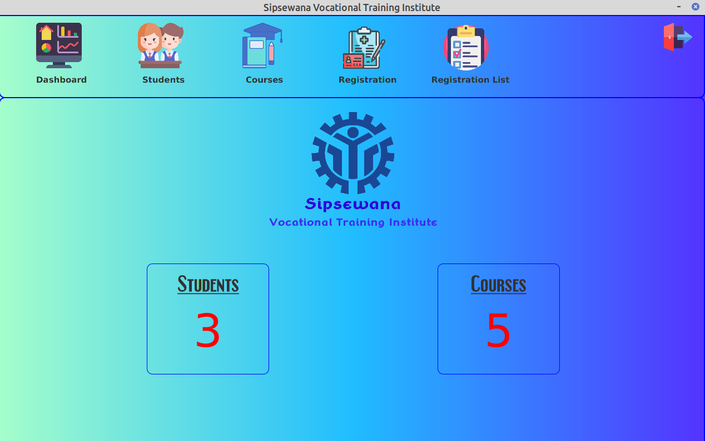
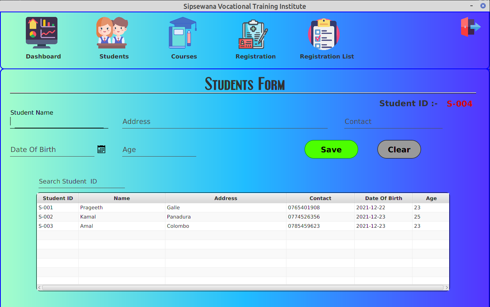
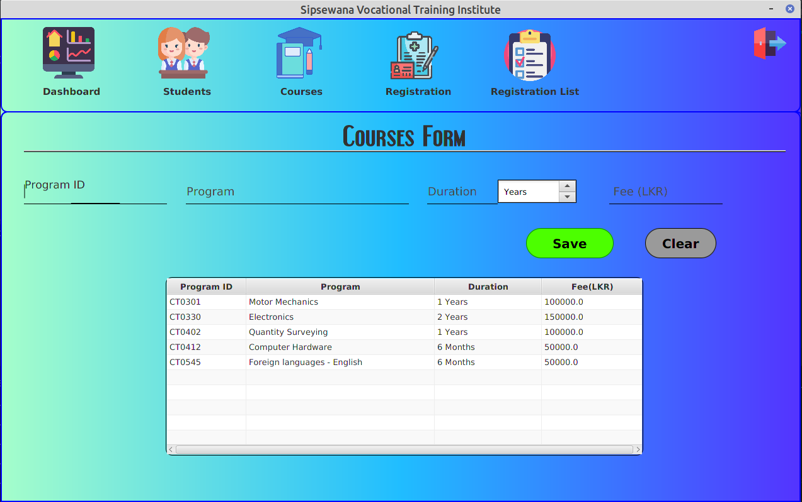
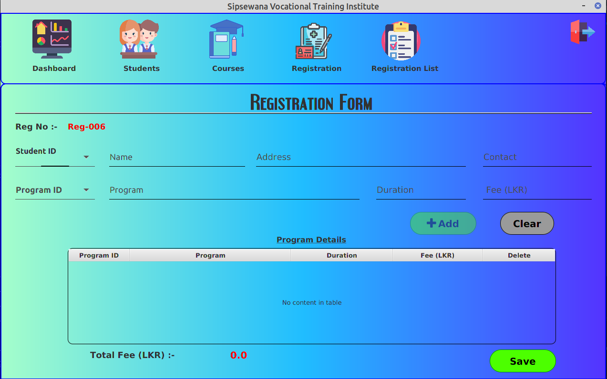
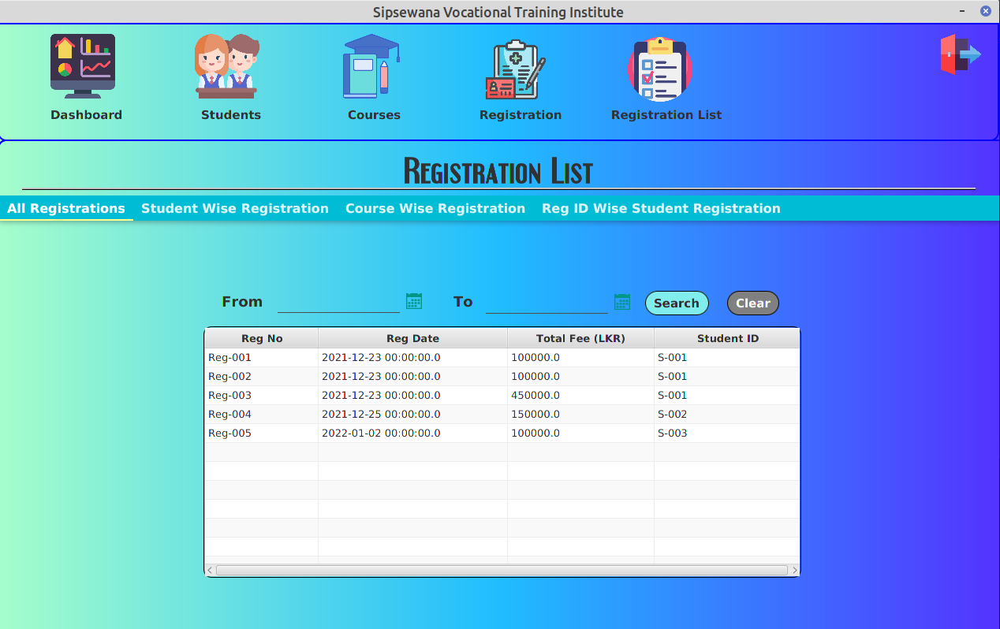
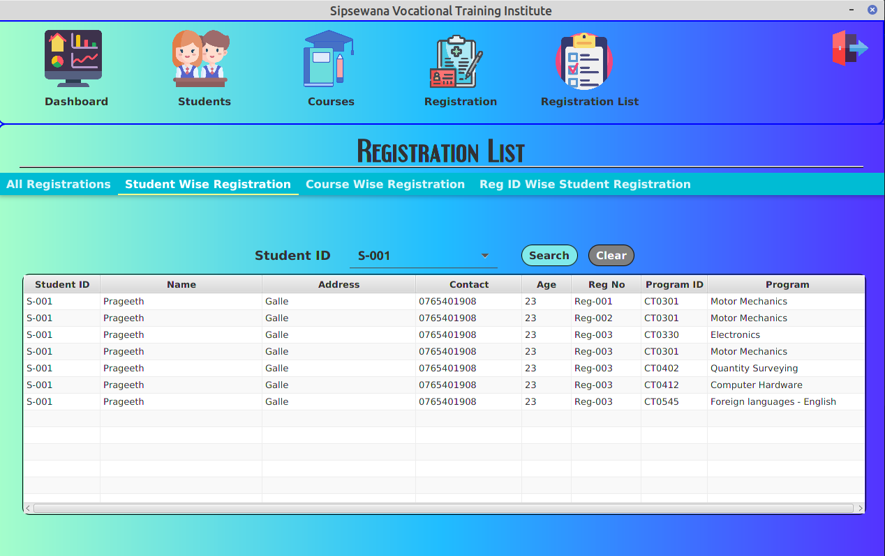
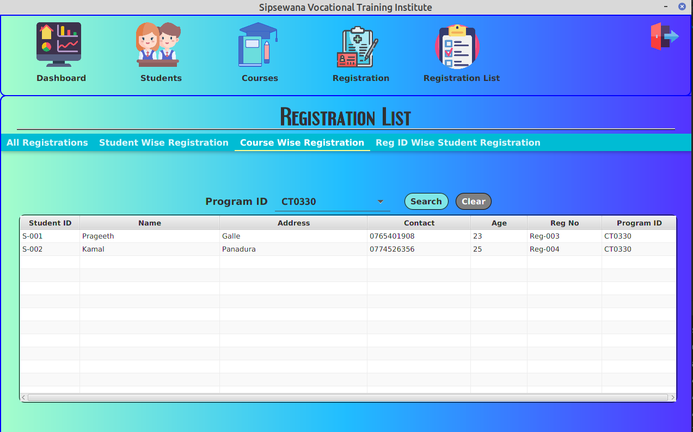
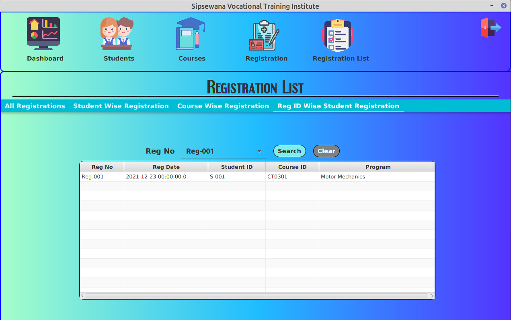

# Vocational Training Center

>**This is a student registration process of vocational training center developed by Prageeth Milan**

## Programming Language that used to develop
>**Java** 

## Framework that used
>**Hibernate**

## Screenshots of Student Registration System

